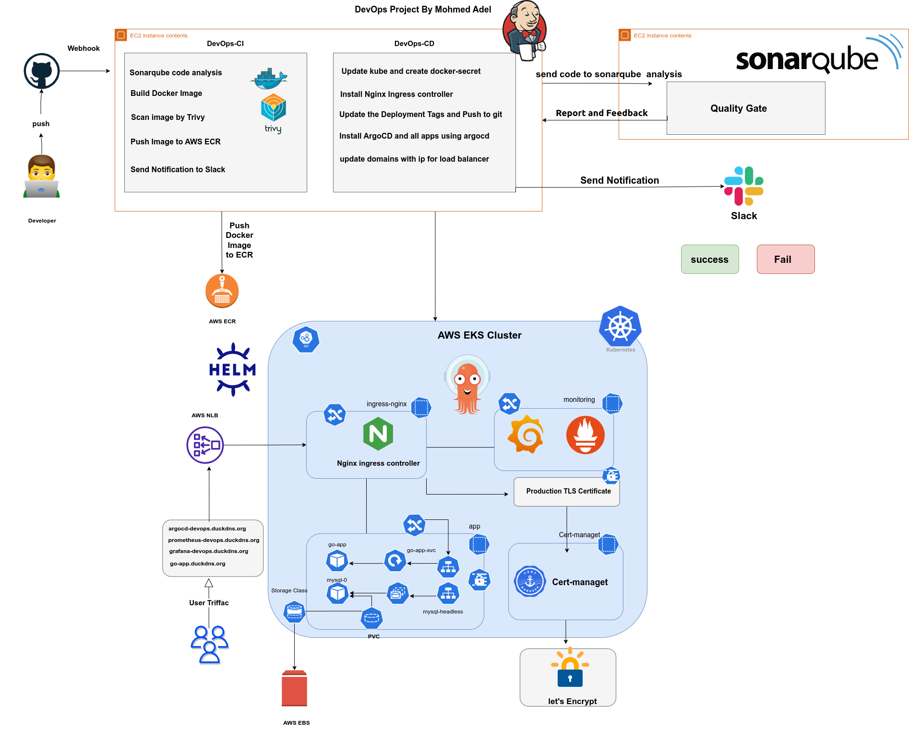

# Demo DevOps Project

## Overview

Welcome to the Demo DevOps Project! This project showcases the power of DevOps principles and modern technologies in automating infrastructure deployment and managing containerized applications. Whether you're a developer, system administrator, or DevOps enthusiast, this project offers valuable insights and a hands-on experience in building, deploying, and managing applications in a cloud-native environment.

## Table of Contents
- [Video Demo](#video-demo)
- [Diagram of Project](#diagram-of-project)
- [Project Features](#project-features)
- [Technologies Used](#technologies-used)
- [GitHub Branches](#github-branches)
- [Prerequisites](#prerequisites)
- [Installation and Configuration](#installation-and-configuration)
- [Usage](#usage)
- [Contributing](#contributing)


## Video Demo
[](https://drive.google.com/file/d/1rSPkdBhXljRm_ifRIrxA9_dfAiidgbnT/view?usp=sharing)
[](https://drive.google.com/file/d/1rSPkdBhXljRm_ifRIrxA9_dfAiidgbnT/preview)


## Diagram of Project



## Project Features

- **Infrastructure as Code (IaC):** Utilizes Terraform to define and provision infrastructure on AWS, including VPC, subnets, EC2 instances, EKS clusters, and more.

- **Automation with Ansible:** Automates the installation and configuration of essential tools like Jenkins, SonarQube, Docker, kubectl, Helm, and more using Ansible playbooks and roles.

- **Containerization:** Leverages Docker for containerization, ensuring application portability and consistency across environments.

- **Continuous Integration/Continuous Deployment (CI/CD):** Employs Jenkins for CI/CD pipelines, enabling automated builds, testing, and deployments.

- **Security Scanning:** Integrates Trivy to scan Docker images for vulnerabilities, enhancing the security posture of containerized applications.

- **Kubernetes Orchestration:** Utilizes Kubernetes (EKS) for container orchestration, simplifying application deployment and scaling.

- **Monitoring and Observability:** Incorporates Prometheus and Grafana for real-time monitoring and visualization of infrastructure and application metrics.

- **SSL/TLS Certificates:** Implements Let's Encrypt and Cert Manager for automated SSL/TLS certificate management, ensuring secure communication.

- **GitOps with ArgoCD:** Employs ArgoCD for GitOps-style continuous delivery, allowing declarative application deployments and Git-driven workflows.

## Technologies Used


- Infrastructure as Code: Terraform

- Configuration Management: Ansible

- Continuous Integration: Jenkins

- Containerization: Docker

- Kubernetes Orchestration: Amazon EKS

- Security Scanning: Trivy

- Observability: Prometheus, Grafana

- SSL/TLS Management: Let's Encrypt, Cert Manager

- GitOps: ArgoCD

- Ingress Controller: NGINX Ingress

## GitHub Branches

This repository is organized into three branches, each focusing on specific aspects of the DevOps pipeline:

### `main` Branch


- **Infrastructure as Code (IaC):** This branch houses a Bash script that orchestrates the deployment and configuration of AWS infrastructure using Terraform and Ansible.

- **Infrastructure Components:** Four Terraform modules define AWS infrastructure elements, and Ansible roles configure these components.

### `jenkins_CI` Branch


- **Continuous Integration (CI):** This branch centers on CI practices.

- **Go Application:** Includes Go source code for a specific application.

- **Dockerization:** Utilizes a Dockerfile to build a Docker image from the Go source code.

- **Jenkins Integration:** The Jenkinsfile defines the CI pipeline using Jenkins.

- **Container Orchestration:** Docker Compose configurations enable running the application and its dependencies via Docker.

### `K8S_argoCD` Branch

- **Continuous Delivery (CD):** The `K8S_argoCD` branch is the epicenter of Continuous Delivery (CD) within this project. It accentuates the deployment facet of the DevOps pipeline with an unwavering focus on Kubernetes.

- **Kubernetes Deployment:** Nestled within this branch lies an exquisitely crafted Helm Chart. This Helm Chart is engineered to seamlessly deploy your Go application and MySQL database within a Kubernetes cluster. It deftly orchestrates the setup of your core application components.

- **ArgoCD YAML Files:** This specific section of the branch plays host to the ArgoCD YAML files. These YAML files align with the "App of Apps" theory and serve as a blueprint for ArgoCD. They empower ArgoCD to expertly manage and orchestrate the deployment of a multitude of applications and services across your Kubernetes cluster. These files encapsulate the desired state of your entire ecosystem.

- **CD Pipeline:** At the helm of this Kubernetes performance stands the `Jenkinsfile`. It is the conductor of your Continuous Delivery pipeline, ensuring each note is played to perfection. It expertly orchestrates the journey, from code changes to application deployments, all carried out with precision.

- **Bash Script:** When it comes to dealing with Docker secrets, the `Jenkinsfile` beckons a Bash script into action. This script adds an additional layer of security to your deployments, diligently safeguarding sensitive information.

This branch represents the zenith of your Continuous Delivery journey, focusing on your core application (Go and MySQL) while expertly orchestrating various services across your Kubernetes cluster. This is achieved through ArgoCD's "App of Apps" paradigm, offering unparalleled control and efficiency.
 

## Prerequisites

Before embarking on this project, ensure you've laid the necessary groundwork:


- An AWS account with appropriate permissions to create resources.

- Installation of Terraform and Ansible, tools instrumental in orchestrating the infrastructure.

- A GitHub account, facilitating version control and collaboration.

- Access to a Slack account for communication and notifications.

Additionally, we recommend adhering to these vital steps before launching the Bash script:


1. Domain Name Customization: Personalize the domain names within the Terraform configurations to align with your specific requirements.

2. Token Exportation: Export the token essential for your DNS provider (e.g., DuckDNS) as an environment variable using the command `export TF_duckdnstoken=<your token in DuckDNS account>`.

3. Configuration Verification: Ensure meticulous configuration of variables or settings, with special attention to Let's Encrypt certificate generation within Ansible.


## Installation and Configuration

### Fork this Repo

Fork the repository by clicking the "Fork" button on the top right corner of this page. This will create a copy of the repository under your GitHub account.

### Clone this Repo

Clone the forked repository to your local machine using the following command:

```bash
git clone https://github.com/<your-username>/Demo-DevOps_project.git
```
Change the working directory to the cloned repo, then run the Bash script to build the infrastructure:

```bash
cd Demo-DevOps_project
bash infrastructure.sh
```

Choose option 3 to Build and Configure Infrastructure in AWS.
## Usage


1. Follow the installation and configuration steps mentioned above.

2. Set up the required credentials and configurations in Jenkins, including AWS, GitHub, SonarQube, and Slack.

3. Create a Jenkins pipeline by specifying the Repository URL of your forked repository's `jenkins_CI` branch.

4. Run the pipeline manually, and it will guide you through the setup, including the SonarQube webhook configuration.

5. Configure the SonarQube webhook within the SonarQube project settings, directing it to your Jenkins server's domain (e.g., `https://<your_domain>/sonarqube-webhook/`).

6. Within your GitHub repository's settings, establish a webhook directing to your Jenkins server's domain (`https://<your_domain>/github-webhook/`).

7. Continue with the requisite configurations on SonarQube, GitHub, ECR, and Slack, all thoughtfully outlined within the project's comprehensive documentation.

## Contributing

Your contributions are immensely valuable to us and the wider community. Do not hesitate to open issues, submit pull requests, or provide feedback. Together, we can enhance and expand this DevOps project, fostering a vibrant and collaborative ecosystem.

<h2> Contact Me</h2>
<a href="https://www.linkedin.com/in/mohmed3adel/"></a>
<a href="mailto:mohmed3del1@gmail.com" target="_blank"></a>
<br/><br/>


